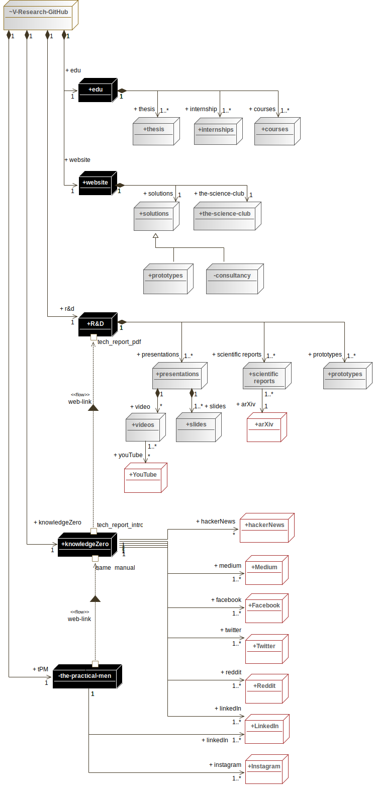

    

        We engineer state-of-the-art security solutions thanks to our (combined) decades of cybersecurity research and commercial expertise in multiple engineering domains that ranges from cyber-physical systems (e.g. in the aerospace domain) to purely IT systems (e.g. networks and security protocols). We cover the engineering process from the very early stages with requirements definition/review and system design and verification, up to system implementation and testing. 
    

    

        We believe that natural language isn't for engineers, uml or similar languages are far better! Hopefully, you'll enjoy our slight abuse of notation in the following map.
    

<map name="dcb809e7-bbd3-4dd1-b082-8afaec084fd1">
    <area alt="V-Research-GitHub" coords="5,0,126,49" href="https://github.com/v-research" name="dcb809e7-bbd3-4dd1-b082-8afaec084fd1" shape="rect">
    <area alt="Medium" coords="394,892,482,941" href="https://knowledgezero.medium.com/" name="dcb809e7-bbd3-4dd1-b082-8afaec084fd1" shape="rect">
    <area alt="Facebook" coords="394,954,482,1002" href="https://www.facebook.com/vresearch.it" name="dcb809e7-bbd3-4dd1-b082-8afaec084fd1" shape="rect">
    <area alt="Twitter" coords="393,1019,482,1068" href="https://twitter.com/marcorocchetto" name="dcb809e7-bbd3-4dd1-b082-8afaec084fd1" shape="rect">
    <area alt="Instagram" coords="394,1172,482,1221" href="https://www.instagram.com/vresearch_it/" name="dcb809e7-bbd3-4dd1-b082-8afaec084fd1" shape="rect">
    <area alt="tech_report_pdf " coords="156,544,228,559" name="dcb809e7-bbd3-4dd1-b082-8afaec084fd1" shape="rect">
    <area alt="tech_report_pdf " coords="145,538,156,549" name="dcb809e7-bbd3-4dd1-b082-8afaec084fd1" shape="rect">
    <area alt="R&amp;D" coords="125,501,190,542" href="https://github.com/v-research/cybersecurity" name="dcb809e7-bbd3-4dd1-b082-8afaec084fd1" shape="rect">
    <area alt="tech_report_intro" coords="156,835,231,850" name="dcb809e7-bbd3-4dd1-b082-8afaec084fd1" shape="rect">
    <area alt="tech_report_intro" coords="145,847,156,857" name="dcb809e7-bbd3-4dd1-b082-8afaec084fd1" shape="rect">
    <area alt="game_manual" coords="80,898,143,913" name="dcb809e7-bbd3-4dd1-b082-8afaec084fd1" shape="rect">
    <area alt="game_manual" coords="147,888,158,899" name="dcb809e7-bbd3-4dd1-b082-8afaec084fd1" shape="rect">
    <area alt="knowledgeZero" coords="92,852,190,893" href="https://www.knowledgezero.com/" name="dcb809e7-bbd3-4dd1-b082-8afaec084fd1" shape="rect">
    <area alt="readme" coords="110,1047,144,1063" name="dcb809e7-bbd3-4dd1-b082-8afaec084fd1" shape="rect">
    <area alt="readme" coords="147,1062,158,1073" name="dcb809e7-bbd3-4dd1-b082-8afaec084fd1" shape="rect">
    <area alt="the-practical-men" coords="84,1067,198,1108" name="dcb809e7-bbd3-4dd1-b082-8afaec084fd1" shape="rect">
    <area alt="website" coords="126,274,190,315" name="dcb809e7-bbd3-4dd1-b082-8afaec084fd1" shape="rect">
    <area alt="LinkedIn" coords="393,1107,482,1156" href="https://www.linkedin.com/company/v-researchit/" name="dcb809e7-bbd3-4dd1-b082-8afaec084fd1" shape="rect">
    <area alt="hackerNews" coords="393,824,482,873" href="https://news.ycombinator.com/" name="dcb809e7-bbd3-4dd1-b082-8afaec084fd1" shape="rect">
    <area alt="arXiv" coords="397,663,462,711" href="https://arxiv.org/" name="dcb809e7-bbd3-4dd1-b082-8afaec084fd1" shape="rect">
    <area alt="edu" coords="125,124,190,165" href="https://edu.v-research.it" name="dcb809e7-bbd3-4dd1-b082-8afaec084fd1" shape="rect">
    <area alt="prototypes" coords="519,582,600,626" name="dcb809e7-bbd3-4dd1-b082-8afaec084fd1" shape="rect">
    <area alt="scientific reports" coords="390,582,469,626" name="dcb809e7-bbd3-4dd1-b082-8afaec084fd1" shape="rect">
    <area alt="presentations" coords="245,582,334,626" href="https://github.com/v-research/cybersecurity/tree/master/presentations" name="dcb809e7-bbd3-4dd1-b082-8afaec084fd1" shape="rect">
    <area alt="slides" coords="283,663,357,711" name="dcb809e7-bbd3-4dd1-b082-8afaec084fd1" shape="rect">
    <area alt="videos" coords="202,663,267,710" name="dcb809e7-bbd3-4dd1-b082-8afaec084fd1" shape="rect">
    <area alt="YouTube" coords="199,743,270,793" name="dcb809e7-bbd3-4dd1-b082-8afaec084fd1" shape="rect">
    <area alt="solutions" coords="215,324,289,371" href="https://v-research.it/solutions.html" name="dcb809e7-bbd3-4dd1-b082-8afaec084fd1" shape="rect">
    <area alt="consultancy" coords="331,423,425,473" name="dcb809e7-bbd3-4dd1-b082-8afaec084fd1" shape="rect">
    <area alt="prototypes" coords="230,423,312,473" href="https://github.com/v-research/cybersecurity/tree/master/prototypes" name="dcb809e7-bbd3-4dd1-b082-8afaec084fd1" shape="rect">
    <area alt="the-science-club" coords="311,324,421,371" href="https://v-research.it/team.html" name="dcb809e7-bbd3-4dd1-b082-8afaec084fd1" shape="rect">
    <area alt="courses" coords="409,188,484,234" name="dcb809e7-bbd3-4dd1-b082-8afaec084fd1" shape="rect">
    <area alt="thesis" coords="213,188,290,234" name="dcb809e7-bbd3-4dd1-b082-8afaec084fd1" shape="rect">
    <area alt="internships" coords="312,189,391,233" name="dcb809e7-bbd3-4dd1-b082-8afaec084fd1" shape="rect">
</map>
