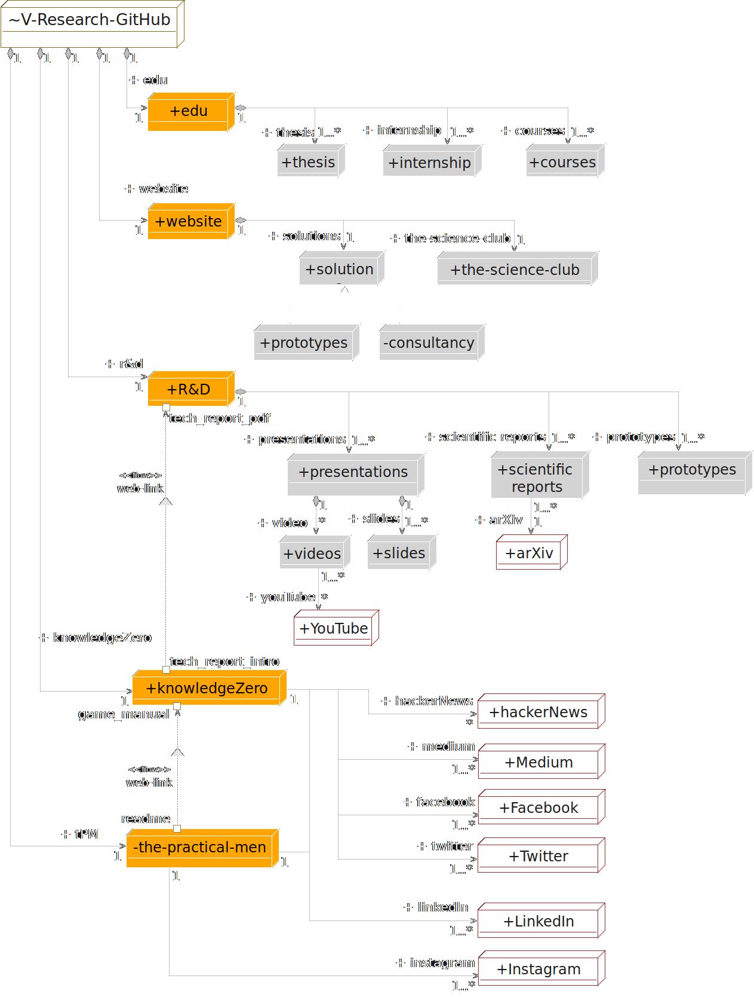

    

        We engineer state-of-the-art security solutions thanks to our (combined) decades of cybersecurity research and commercial expertise in multiple engineering domains that ranges from cyber-physical systems (OT systems) to purely IT systems (e.g. networks and security protocols). We cover the engineering process from the very early stages with requirements definition/review and system design and verification, up to system implementation and testing. 
    

    

	As engineers we don't like to use a natural language to describe v-research.
	Hopefully, you'll enjoy our slight abuse of notation in the following UML deployment diagram.
    

<map name="dcb809e7-bbd3-4dd1-b082-8afaec084fd1">
<area alt="V-Research-GitHub" coords="0,0,147,38" href="https://github.com/v-research" name="dcb809e7-bbd3-4dd1-b082-8afaec084fd1" shape="rect">
<area alt="Medium" coords="380,590,482,619" href="https://knowledgezero.medium.com/" name="dcb809e7-bbd3-4dd1-b082-8afaec084fd1" shape="rect">
<area alt="Facebook" coords="380,627,482,655" href="https://www.facebook.com/vresearch.it"  name="dcb809e7-bbd3-4dd1-b082-8afaec084fd1" shape="rect">
<area alt="Twitter" coords="380,665,482,694" href="https://twitter.com/marcorocchetto" name="dcb809e7-bbd3-4dd1-b082-8afaec084fd1" shape="rect">
<area alt="Instagram" coords="380,755,482,783" href="https://www.instagram.com/vresearch_it/" name="dcb809e7-bbd3-4dd1-b082-8afaec084fd1" shape="rect">
<area alt="tech_report_pdf " coords="134,325,218,340" name="dcb809e7-bbd3-4dd1-b082-8afaec084fd1" shape="rect">
<area alt="tech_report_pdf " coords="129,320,135,326" name="dcb809e7-bbd3-4dd1-b082-8afaec084fd1" shape="rect">
<area alt="R&amp;D" coords="117,294,187,323" href="https://github.com/v-research/cybersecurity" name="dcb809e7-bbd3-4dd1-b082-8afaec084fd1" shape="rect">
<area alt="tech_report_intro" coords="135,518,222,533" name="dcb809e7-bbd3-4dd1-b082-8afaec084fd1" shape="rect">
<area alt="tech_report_intro" coords="129,529,135,535" name="dcb809e7-bbd3-4dd1-b082-8afaec084fd1" shape="rect">
<area alt="game_manual" coords="62,560,134,575" name="dcb809e7-bbd3-4dd1-b082-8afaec084fd1" shape="rect">
<area alt="game_manual" coords="137,558,143,564" name="dcb809e7-bbd3-4dd1-b082-8afaec084fd1" shape="rect">
<area alt="knowledgeZero" coords="104,532,228,561" href="https://www.knowledgezero.com/" name="dcb809e7-bbd3-4dd1-b082-8afaec084fd1" shape="rect">
<area alt="readme" coords="96,643,135,658" name="dcb809e7-bbd3-4dd1-b082-8afaec084fd1" shape="rect">
<area alt="readme" coords="137,655,143,661" name="dcb809e7-bbd3-4dd1-b082-8afaec084fd1" shape="rect">
<area alt="the-practical-men" coords="100,658,222,690" href="https://github.com/v-research/the-practical-men" name="dcb809e7-bbd3-4dd1-b082-8afaec084fd1" shape="rect">
<area alt="website" coords="117,161,187,190" href="https://github.com/v-research/website" name="dcb809e7-bbd3-4dd1-b082-8afaec084fd1" shape="rect">
<area alt="LinkedIn" coords="380,717,482,745" href="https://www.linkedin.com/company/v-researchit/" name="dcb809e7-bbd3-4dd1-b082-8afaec084fd1" shape="rect">
<area alt="hackerNews" coords="380,551,482,579" href="https://news.ycombinator.com/" name="dcb809e7-bbd3-4dd1-b082-8afaec084fd1" shape="rect">
<area alt="arXiv" coords="394,424,452,453" href="https://arxiv.org/" name="dcb809e7-bbd3-4dd1-b082-8afaec084fd1" shape="rect">
<area alt="edu" coords="117,73,187,104" href="https://edu.v-research.it" name="dcb809e7-bbd3-4dd1-b082-8afaec084fd1" shape="rect">
<area alt="prototypes" coords="507,358,599,393" href="https://github.com/v-research/cybersecurity/tree/master/prototypes" name="dcb809e7-bbd3-4dd1-b082-8afaec084fd1" shape="rect">
<area alt="scientific reports" coords="390,358,469,396" href="https://github.com/v-research/cybersecurity/tree/master/reports" name="dcb809e7-bbd3-4dd1-b082-8afaec084fd1" shape="rect">
<area alt="presentations" coords="228,360,338,394" href="https://github.com/v-research/cybersecurity/tree/master/presentations" name="dcb809e7-bbd3-4dd1-b082-8afaec084fd1" shape="rect">
<area alt="slides" coords="292,424,348,453" name="dcb809e7-bbd3-4dd1-b082-8afaec084fd1" shape="rect">
<area alt="videos" coords="222,425,279,452" name="dcb809e7-bbd3-4dd1-b082-8afaec084fd1" shape="rect">
<area alt="YouTube" coords="233,484,302,513" name="dcb809e7-bbd3-4dd1-b082-8afaec084fd1" shape="rect">
<area alt="solutions" coords="238,199,306,227" href="https://v-research.it/solutions.html" name="dcb809e7-bbd3-4dd1-b082-8afaec084fd1" shape="rect">
<area alt="consultancy" coords="301,257,386,286" href="https://v-research.it/solutions.html" name="dcb809e7-bbd3-4dd1-b082-8afaec084fd1" shape="rect">
<area alt="prototypes" coords="201,257,286,286" href="https://github.com/v-research/cybersecurity/tree/master/prototypes" name="dcb809e7-bbd3-4dd1-b082-8afaec084fd1" shape="rect">
<area alt="the-science-club" coords="347,199,476,227" href="https://v-research.it/team.html" name="dcb809e7-bbd3-4dd1-b082-8afaec084fd1" shape="rect">
<area alt="courses" coords="418,114,482,141" href="https://edu.v-research.it" name="dcb809e7-bbd3-4dd1-b082-8afaec084fd1" shape="rect">
<area alt="thesis" coords="220,114,275,141" href="https://edu.v-research.it" name="dcb809e7-bbd3-4dd1-b082-8afaec084fd1" shape="rect">
<area alt="internships" coords="304,114,384,140" href="https://edu.v-research.it" name="dcb809e7-bbd3-4dd1-b082-8afaec084fd1" shape="rect">
</map>

