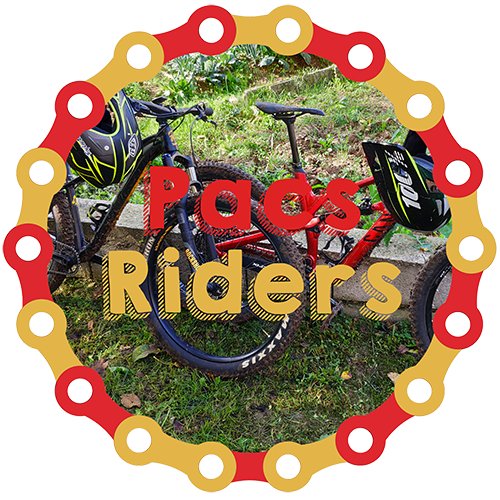

  <h3 class="w-100">
        V-Research friends help us not directly in cybersecurity but to improve our company in different fields
  </h3>

<!-- 311 Verona -->

    

        
    

    

    <h3 class="orange">
        311 Verona
    </h3>
    

        311 Verona is an innovation hub. There is our HQ and you can also meet a community professionals, startups, multinationals, NGOs and young talents. They help us to develop our Education Department.
    

    

        <a href="https://311verona.com/" target="blank">
            <i class="fas fa-globe fa-lg social-icon"></i>
        </a>
        <a href="https://it.linkedin.com/company/311-verona" target="blank">
            <i class="fab fa-linkedin fa-lg social-icon"></i>
        </a>
        <a href="https://twitter.com/311verona" target="blank">
            <i class="fab fa-twitter fa-lg social-icon"></i>
        </a>
        <a href="https://www.instagram.com/311verona/" target="blank">
            <i class="fab fa-instagram fa-lg social-icon"></i>
        </a>
        <a href="https://www.facebook.com/311verona/" target="blank">
            <i class="fab fa-facebook-f fa-lg social-icon"></i>
        </a>
    

<!-- Pacs Riders -->

    

        
    

    

    <h3 class="orange">
        Pacs Riders
    </h3>
    

        Pacs Riders is a YouTube channel that mainly talks about bicycles, with a special eye for MTB. They support us suggesting the best bicycles for commuting and they help us to improve our YouTube channel.
    

    

        <!--<a href="https://pacsriders.it/" target="blank">
            <i class="fas fa-globe fa-lg social-icon"></i>
        </a>-->
        <a href="https://www.youtube.com/c/PacsRiders" target="blank">
            <i class="fab fa-youtube fa-lg social-icon"></i>
        </a>
        <a href="https://www.instagram.com/pacs_riders/" target="blank">
            <i class="fab fa-instagram fa-lg social-icon"></i>
        </a>
        <a href="https://www.facebook.com/pacsriders" target="blank">
            <i class="fab fa-facebook-f fa-lg social-icon"></i>
        </a>
    

