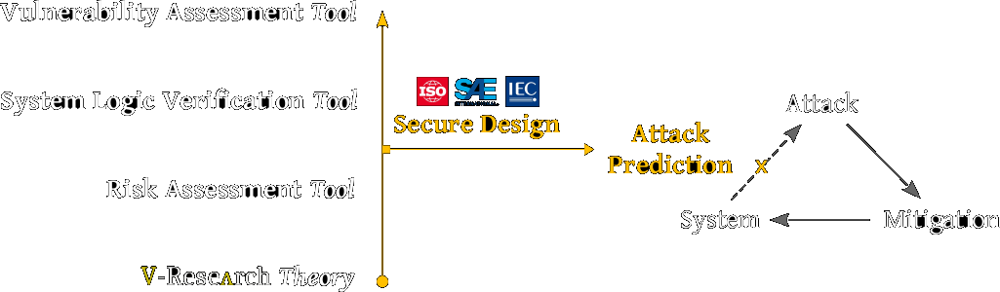

<!-- consultancy -->

    <h3 class="w-100"> Consultancy </h3>
    

        V-Research consultancy complement the customers' internal resources providing tailored support in both the <b>engineering and Cybersecurity</b> domains which covers for:
    

    <ul>
        <li>
            establishing a <b>cybersecurity framework for risk management</b> (e.g. <a href="https://www.itgovernanceusa.com/iso27001-and-nist" target="_blank">[NIST/ISO]</a>) and security maturation programs,
        </li>
        <li>
            identifying the appropriate <b>technical standards and security controls set</b> (e.g. NIST Special Publications)
        </li>
        <li>
            supporting the customer in platform evaluation and selection, standards and regulations conformance or compliance testing,
        </li>
        <li>
            <b>review of state-of-the-art commercial products</b> or academic solutions (<b>whenever commercial products are not available</b> or don't fit customer needs),
        </li>
        <li>
            assisting from problem statement definition to the engineering and <b><a href="https://cfwebprod.sandia.gov/cfdocs/CompResearch/docs/TRL-Guidance-final.pdf" target="_blank">TRL maturation plan</a></b>,
        </li>
        <li>
            RFP/tender, partnership and security assurance.
        </li>
    </ul>
    

        Please reach out to our team via email <a href="mailto: info@v-research.it" target="blank"> info@v-research.it </a> to involve us in your challenge!
        We will send you a project plan (draft) to justify the person-hour, and you can purchase person-hour/week/month below.
    

<!-- purchase-options -->

    <h3 class="w-100"> Purchase Options </h3>
    

        Our purchase options will be made available soon, please contact us via email <a href="mailto: info@v-research.it" target="blank"> info@v-research.it </a> for a quote.
    

<!-- open-source -->

    <h3 class="w-100"> Open-Source </h3>
    

        A minimum of 20% of the incomes is used to support the research & development of the following open-source tool-chain for the secure engineering of cyber-physical systems.
    

    

<!-- prototypes -->

    <h3 class="w-100"> Prototypes </h3>
    

        As a research lab, we provide reports and prototypes. Our prototypes are not "just" innovating something which exists, we create the materials for what will be. Our prototypes are based on other prototypes, on unstable grounds. But they solve complex theoretical and engineering challenges such as calculating the (natural) number of security weaknesses in the design of a cyber-physical system. Our code isn't clean, you cannot design new ideas. But we look forward to maturate our prototypes with the industry and for the industry.
    

    <ol>
        <li>
            cybersecurity risk assessment&nbsp;-> <a href="https://github.com/v-research/cybersecurity/tree/master/prototypes" target="blank">prototype & more</a>
        </li>
        <li>
            system logic security verification&nbsp;-> <a href="https://github.com/v-research/cybersecurity/tree/master/prototypes" target="blank">under development</a>
        </li>
        <li>
            vulnerability assessment&nbsp;-> <a href="https://github.com/v-research/cybersecurity/tree/master/prototypes" target="blank">TBA</a>
        </li>
    </ol>
    

        For the TRL maturation plan, see our business plan and mission <a href="buplan.html">here</a>.
    

<iframe width="560" height="315" src="https://www.youtube.com/embed/oakPpYRTCLg" title="YouTube video player" frameborder="0" allow="accelerometer; autoplay; clipboard-write; encrypted-media; gyroscope; picture-in-picture" allowfullscreen></iframe>

