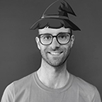

<!-- Francesco -->

  

    
  

  

    <h3 class="orange">
      Francesco Beltramini
    </h3>
    

      Security + Technology + Photography + Outdoors. I wish days were longer than 24h. 
    

    <a href="" data-toggle="modal" data-target="#modalFra">
      Read more
    </a>
  

<!-- Modal -->

  

    

      

        <h2 class="modal-title orange">
          Francesco Beltramini
        </h2>
        <button type="button" class="close modal-close" data-dismiss="modal" aria-label="Close">
          &times;
        </button>
      

      

        I'm a cybersecurity professional, co-founder of V-Research. I'm also Head of Security Engineering at Inmarsat, London UK. I received my MSc in Computer Science in 2009 from the University of Verona (Italy). I worked for four years for the European Government in London, UK as a Security Administrator. In 2015 I moved to Inmarsat as Chief Security Engineer for the Satellite Control Centre, until 2019 when I became Head of Security Operations Engineering. In my career, I had the opportunity of working on several high-end projects in the IT and OT space, ranging from Cloud to high-assurance systems in mission-critical infrastructure.
          
        <a href="https://www.linkedin.com/in/francescobeltramini/" target="blank">
          <i class="fab fa-linkedin fa-lg social-icon"></i>
        </a>
      

    

  

<!-- Federico -->

  

    
  

  

    <h3 class="orange">
      Federico De Meo
    </h3>
    

      I have a love-hate relationship with most of the Turing machines out there.  
    

    <a href="" data-toggle="modal" data-target="#modalFed">
      Read more
    </a>
  

<!-- Modal -->

  

    

      

        <h2 class="modal-title orange">
          Federico De Meo
        </h2>
        <button type="button" class="close modal-close" data-dismiss="modal" aria-label="Close">
          &times;
        </button>
      

      

        I've always been curios about stuff and I've started by disassembly the only technological item I had at my disposal as a kid: watches. I wanted to know what was inside and how it worked. One day I received a magical box that I didn't really need to disassembly to understand how it worked if I managed to ask the right questions nicely. Two decades later, while waiting for my letter from Hogwarts, I practice my dark arts with computer science, the only other thing close to magical spells that I know how to cast.
          
        <a href="https://rhaidiz.net" target="blank">
          <i class="fas fa-user fa-lg social-icon"></i>
        </a>
        <a href="https://github.com/rhaidiz" target="blank">
          <i class="fab fa-github fa-lg social-icon"></i>
        </a>
        <a href="https://twitter.com/rhaidiz" target="blank">
          <i class="fab fa-twitter fa-lg social-icon"></i>
        </a>
        <a href="https://dblp.uni-trier.de/pid/180/5370.html" target="blank">
          <i class="fas fa-book fa-lg social-icon"></i>
        </a>
      

    

  

<!-- Oliviero -->

  

    
  

  

    <h3 class="orange">
      Oliviero Nardi
    </h3>
    

      Currently trying to find the common thread between my disparate and seemingly contradictory interests.  
    

    <a href="" data-toggle="modal" data-target="#modalOli">
      Read more
    </a>
  

<!-- Modal -->

  

    

      

        <h2 class="modal-title orange">
          Oliviero Nardi
        </h2>
        <button type="button" class="close modal-close" data-dismiss="modal" aria-label="Close">
          &times;
        </button>
      

      

        I have studied Computer Science at the University of Verona, where I have discovered my passion about theoretical computer science and discrete mathematics. I am now finishing my Master's Degree in Artificial Intelligence at the University of Amsterdam, where I am writing a thesis about automated proof synthesis in the context of collective decision making.  
        I enjoy thinking about everything connected to formal disciplines, from logic to poetry, and from music to recursion theory. In the future I would like to pursue a PhD and study the connections between intelligence, sensory experiences and symbolic representations. I am also into eastern philosophy and, most importantly, I love animals very much.
          
        <a href="mailto:olivieronardi@gmail.com" target="blank">
          <i class="fas fa-envelope fa-lg social-icon"></i>
        </a>
      

    

  

<!-- Mattia -->

  

    
  

  

    <h3 class="orange">
      Mattia Pacchin
    </h3>
    

      IT, DIY and MTB lover. I built a wooden pc holder for my bicycle handlebar to program while riding on my favorite trails.  
    

    <a href="" data-toggle="modal" data-target="#modalMat">
      Read more
    </a>
  

<!-- Modal -->

  

    

      

        <h2 class="modal-title orange">
          Mattia Pacchin
        </h2>
        <button type="button" class="close modal-close" data-dismiss="modal" aria-label="Close">
          &times;
        </button>
      

      

        I started studying IT at secondary school, now I’m studying Computer Science at the University of Verona. When I’m not lost in the mountains with MTBs and friends looking for cows and drops, I like developing DIY tech projects with Arduino and Raspberry, particularly in IoT field. Then why don't make my prototypes much cooler with self-made speakers and leds? And don’t forget: I don’t want other people to hack my projects!
          
        <a href="https://github.com/PacMat99" target="blank">
          <i class="fab fa-github fa-lg social-icon"></i>
        </a>
        <a href="https://www.linkedin.com/in/mattia-pacchin-255802167/" target="blank">
          <i class="fab fa-linkedin fa-lg social-icon"></i>
        </a>
        <a href="mailto:mattia@v-research.it" target="blank">
          <i class="fas fa-envelope fa-lg social-icon"></i>
        </a>
        <a href="https://www.instagram.com/mattiapacchin/" target="blank">
          <i class="fab fa-instagram fa-lg social-icon"></i>
        </a>
        <a href="https://www.instagram.com/pacs_riders/" target="blank">
          <i class="fab fa-instagram fa-lg social-icon"></i>
        </a>
        <a href="https://www.youtube.com/c/PacsRiders/" target="blank">
          <i class="fab fa-youtube fa-lg social-icon"></i>
        </a>
        <a href="https://www.facebook.com/Pacchinmattia" target="blank">
          <i class="fab fa-facebook-f fa-lg social-icon"></i>
        </a>
      

    

  

<!-- Marco -->

  

    
  

  

    <h3 class="orange">
      Marco Rocchetto
    </h3>
    

      I love my family, reading, theoretical works, scientific quests, formal methods, cybersecurity, and philosophy. I truly hate wasting my time sleeping.  
    

    <a href="" data-toggle="modal" data-target="#modalMar">
      Read more
    </a>
  

<!-- Modal -->

  

    

      

        <h2 class="modal-title orange">
          Marco Rocchetto
        </h2>
        <button type="button" class="close modal-close" data-dismiss="modal" aria-label="Close">
          &times;
        </button>
      

      

        I’m a cybersecurity researcher, co-founder of V-Research. I got my PhD in Computer Science in 2015 from the University of Verona (Italy). I worked as Senior Research Engineer in the Security Team of the Formal Methods Research Group at the United Technologies Research Center (2017-2019), and as a Researcher at the University of Luxembourg (2016-2017) and at the Singapore University of Technology and Design (2015-2016). My research interests cover Security Engineering, Formal Security Verification, and Cyber-Physical Systems Security. I’ve several publications (in international conferences and journal), and patents in the field of Cybersecurity.
          
        <a href="https://marcorocchetto.eu " target="blank">
          <i class="fas fa-user fa-lg social-icon"></i>
        </a>
        <a href="https://www.linkedin.com/in/marco-rocchetto/" target="blank">
          <i class="fab fa-linkedin fa-lg social-icon"></i>
        </a>
        <a href="https://github.com/rocchettomarco" target="blank">
          <i class="fab fa-github fa-lg social-icon"></i>
        </a>
        <a href="https://twitter.com/marcorocchetto" target="blank">
          <i class="fab fa-twitter fa-lg social-icon"></i>
        </a>
        <a href="https://www.facebook.com/marco.rocchetto/" target="blank">
          <i class="fab fa-facebook-f fa-lg social-icon"></i>
        </a>
        <a href="mailto:marco@v-research.it" target="blank">
          <i class="fas fa-envelope fa-lg social-icon"></i>
        </a>
        <a href="https://patents.google.com/?inventor=marco+rocchetto&oq=marco+rocchetto" target="blank">
          <i class="fas fa-stamp fa-lg social-icon"></i>
        </a>
        <a href="https://dblp.uni-trier.de/pid/71/11109.html" target="blank">
          <i class="fas fa-book fa-lg social-icon"></i>
        </a>
        <a href="https://scholar.google.com/citations?user=t6XA3qsAAAAJ&hl=en&oi=ao" target="blank">
          <i class="fas fa-graduation-cap fa-lg social-icon"></i>
        </a>
      

    

  

