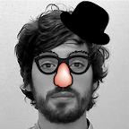
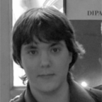
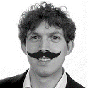

<!-- Michele -->

  

    
  

  

    <h3 class="orange">Michele Ambrosi</h3>
    

	I love technology and tripping on its impacts on society.
    

    <a href="" data-toggle="modal" data-target="#modalMic">
      Read more
    </a>
  

<!-- Modal -->

  

    

      

        <h2 class="modal-title orange">
            Michele Ambrosi
        </h2>
        <button type="button" class="close modal-close" data-dismiss="modal" aria-label="Close">
          &times;
        </button>
      

      

       I'm passionate about stories and videogames. My dream is to buy a small boat and live my life reading books while cradled by sea waves (surrounded by hundreds of seals of course).
I'm a cybersecurity engineer and I got my master degree in Cybersecurity and Software Engineering in 2011 from the University of Verona (Italy). I worked as Software Engineer for 10 years, 4 of which at Unicredit Services. I never lost my interest in Cybersecurity and I seized all the opportunities that came to apply it within the projects I was involved. 2022 was the right time to get back to my original passion and to be dedicated full-time to Cybersecurity. 
          
        <a href="https://www.linkedin.com/in/michele-ambrosi-32275534/" target="blank">
          <i class="fab fa-linkedin fa-lg social-icon"></i>
        </a>
      

    

  

<!-- Francesco -->

  

    
  

  

    <h3 class="orange">
      Francesco Beltramini
    </h3>
    

      Security + Technology + Photography + Outdoors. I wish days were longer than 24h. 
    

    <a href="" data-toggle="modal" data-target="#modalFra">
      Read more
    </a>
  

<!-- Modal -->

  

    

      

        <h2 class="modal-title orange">
          Francesco Beltramini
        </h2>
        <button type="button" class="close modal-close" data-dismiss="modal" aria-label="Close">
          &times;
        </button>
      

      

        I'm a cybersecurity professional, co-founder of V-Research. I received my MSc in Computer Science in 2009 from the University of Verona (Italy). I worked for four years for the European Government in London, UK as a Security Administrator. In 2015 I moved to Inmarsat as Chief Security Engineer for the Satellite Control Centre, until 2019 when I became Head of Security Operations Engineering. In my career, I had the opportunity of working on several high-end projects in the IT and OT space, ranging from Cloud to high-assurance systems in mission-critical infrastructure.
          
        <a href="https://www.linkedin.com/in/francescobeltramini/" target="blank">
          <i class="fab fa-linkedin fa-lg social-icon"></i>
        </a>
      

    

  

<!-- Valter Carturo -->

  

    
  

  

    <h3 class="orange">Valter Carturo</h3>
    

    #Innovation #cybersecurity #startup
    

    <a href="" data-toggle="modal" data-target="#modalVal">
      Read more
    </a>
  

<!-- Modal -->

  

    

      

        <h2 class="modal-title orange">Valter Carturo</h2>
        <button type="button" class="close modal-close" data-dismiss="modal" aria-label="Close">
          &times;
        </button>
      

      

I collaborate with the University of Verona and the Politecnico of Milan, together with other incubators, to support and mentor highly innovative business (from biotechnology, genetics, medicine, ICT, and my beloved cybersecurity). I'm always looking for new ideas and innovative start-up to drive their growth within an international context.
          
        <a href="https://www.linkedin.com/in/valter-carturo-5394752/" target="blank">
          <i class="fab fa-linkedin fa-lg social-icon"></i>
        </a>
      

    

  

<!-- Davide -->

  

    
  

  

    <h3 class="orange">Davide Ferri</h3>
    

	Math, music, puzzles and everything abstract.
    

    <a href="" data-toggle="modal" data-target="#modalDav">
      Read more
    </a>
  

<!-- Modal -->

  

    

      

        <h2 class="modal-title orange">
		Davide Ferri
        </h2>
        <button type="button" class="close modal-close" data-dismiss="modal" aria-label="Close">
          &times;
        </button>
      

      

I got my master degree in Mathematics from the Università degli Studi di Milano (Italy) in 2020, with a thesis on formal methods applied to functional programming languages. I've worked for 3 years as a senior full stack developer and cloud engineer at Avvale, where I developed a keen interest in cybersecurity. Now I strive to make cybersecurity better with the help of math and formal methods.
          
        <a href="https://www.linkedin.com/in/davide-ferri-7959b3193/" target="blank">
          <i class="fab fa-linkedin fa-lg social-icon"></i>
        </a>
      

    

  

<!-- Jeisson -->

  

    
  

  

    <h3 class="orange">Jeisson Andrea Moretti</h3>
    

	Just a broken boy who has nothing left than love the world (In particular cybersecurity and writing)
    

    <a href="" data-toggle="modal" data-target="#modalJei">
      Read more
    </a>
  

<!-- Modal -->

  

    

      

        <h2 class="modal-title orange"> Jeisson Andrea Moretti </h2>
        <button type="button" class="close modal-close" data-dismiss="modal" aria-label="Close">
          &times;
        </button>
      

      

                 
        <a href="https://www.linkedin.com/in/jeisson-andrea-moretti-921666266/" target="blank">
          <i class="fab fa-linkedin fa-lg social-icon"></i>
        </a>
      

    

  

<!-- Mattia -->

  

    
  

  

    <h3 class="orange">
      Mattia Pacchin
    </h3>
    

      IT, DIY and MTB lover. I built a wooden pc holder for my bicycle handlebar to program while riding on my favorite trails.  
    

    <a href="" data-toggle="modal" data-target="#modalMat">
      Read more
    </a>
  

<!-- Modal -->

  

    

      

        <h2 class="modal-title orange">
          Mattia Pacchin
        </h2>
        <button type="button" class="close modal-close" data-dismiss="modal" aria-label="Close">
          &times;
        </button>
      

      

        I started studying IT at secondary school, now I’m studying Computer Science at the University of Verona. When I’m not lost in the mountains with MTBs and friends looking for cows and drops, I like developing DIY tech projects with Arduino and Raspberry, particularly in IoT field. Then why don't make my prototypes much cooler with self-made speakers and leds? And don’t forget: I don’t want other people to hack my projects!
          
        <a href="https://github.com/PacMat99" target="blank">
          <i class="fab fa-github fa-lg social-icon"></i>
        </a>
        <a href="https://www.linkedin.com/in/mattia-pacchin-255802167/" target="blank">
          <i class="fab fa-linkedin fa-lg social-icon"></i>
        </a>
        <a href="mailto:mattia@v-research.it" target="blank">
          <i class="fas fa-envelope fa-lg social-icon"></i>
        </a>
        <a href="https://www.instagram.com/mattiapacchin/" target="blank">
          <i class="fab fa-instagram fa-lg social-icon"></i>
        </a>
        <a href="https://www.instagram.com/pacs_riders/" target="blank">
          <i class="fab fa-instagram fa-lg social-icon"></i>
        </a>
        <a href="https://www.youtube.com/c/PacsRiders/" target="blank">
          <i class="fab fa-youtube fa-lg social-icon"></i>
        </a>
        <a href="https://www.facebook.com/Pacchinmattia" target="blank">
          <i class="fab fa-facebook-f fa-lg social-icon"></i>
        </a>
      

    

  

<!-- Marco -->

  

    
  

  

    <h3 class="orange">
      Marco Rocchetto
    </h3>
    

      I love my family, reading, theoretical works, scientific quests, formal methods, cybersecurity, and philosophy. I truly hate wasting my time sleeping.  
    

    <a href="" data-toggle="modal" data-target="#modalMar">
      Read more
    </a>
  

<!-- Modal -->

  

    

      

        <h2 class="modal-title orange">
          Marco Rocchetto
        </h2>
        <button type="button" class="close modal-close" data-dismiss="modal" aria-label="Close">
          &times;
        </button>
      

      

        I’m a cybersecurity researcher, co-founder of V-Research. I got my PhD in Computer Science in 2015 from the University of Verona (Italy). I worked as Senior Research Engineer in the Security Team of the Formal Methods Research Group at the United Technologies Research Center (2017-2019), and as a Researcher at the University of Luxembourg (2016-2017) and at the Singapore University of Technology and Design (2015-2016). My research interests cover Security Engineering, Formal Security Verification, and Cyber-Physical Systems Security. I’ve several publications (in international conferences and journal), and patents in the field of Cybersecurity.
          
        <a href="https://marcorocchetto.eu " target="blank">
          <i class="fas fa-user fa-lg social-icon"></i>
        </a>
        <a href="https://www.linkedin.com/in/marco-rocchetto/" target="blank">
          <i class="fab fa-linkedin fa-lg social-icon"></i>
        </a>
        <a href="https://github.com/rocchettomarco" target="blank">
          <i class="fab fa-github fa-lg social-icon"></i>
        </a>
        <a href="https://twitter.com/marcorocchetto" target="blank">
          <i class="fab fa-twitter fa-lg social-icon"></i>
        </a>
        <a href="https://www.facebook.com/marco.rocchetto/" target="blank">
          <i class="fab fa-facebook-f fa-lg social-icon"></i>
        </a>
        <a href="mailto:marco@v-research.it" target="blank">
          <i class="fas fa-envelope fa-lg social-icon"></i>
        </a>
        <a href="https://patents.google.com/?inventor=marco+rocchetto&oq=marco+rocchetto" target="blank">
          <i class="fas fa-stamp fa-lg social-icon"></i>
        </a>
        <a href="https://dblp.uni-trier.de/pid/71/11109.html" target="blank">
          <i class="fas fa-book fa-lg social-icon"></i>
        </a>
        <a href="https://scholar.google.com/citations?user=t6XA3qsAAAAJ&hl=en&oi=ao" target="blank">
          <i class="fas fa-graduation-cap fa-lg social-icon"></i>
        </a>
      

    

  

